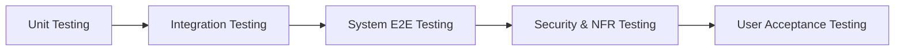

# 🧪 Software Test Plan (STP) — Real-Time Chat Application

> **Software Engineering Mini Project**  
> **Topic:** Real-Time Chat Application (Socket Programming)  
> **Artifact Type:** Software Test Plan (STP) & Requirements Traceability Matrix (RTM)

---

## 📑 Repository Contents

This repository contains the official testing documentation, test case specifications, test environment configurations, and traceability metrics for the **Real-Time Chat Application**.

| File | Description | Format |
| :--- | :--- | :--- |
| 📄 [`Team_5_TEST_Chat_Application.pdf`](./Team_5_TEST_Chat_Application.pdf) | Formal IEEE 829 Software Test Plan (STP) Document | PDF |
| 📘 [`README.md`](./README.md) | Comprehensive Test Suite Overview & Executive Summary | Markdown |

---

## 👥 Team Members & Contributions

| Name | SRN | Key Responsibilities & Contributions |
| :--- | :--- | :--- |
| **Pranay Shah** | `PES2UG24CS366` | **Product Owner & QA Reviewer**: Section 1 (Introduction), Section 9 (Roles & Responsibilities); overall document structuring, compilation, and final review. |
| **Nikhil Mahabala Shekar** | `PES2UG24CS318` | **Test Engineer (Functional)**: Section 2-4 (Test Items, Features to be Tested, Features Not to be Tested), Section 6 (Test Environment), functional test cases design & execution. |
| **Prarthana Herur** | `PES2UG24CS367` | **QA Lead & Security Specialist**: Section 5 (Test Approach & Security Validation), Section 10 (Risks & Mitigation), security & NFR test suite design. |
| **Nikhil B Menon** | `PES2UG24CS317` | **Test Engineer (NFR & Automation)**: Section 7-8 (Test Schedule & Deliverables), Section 11-12 (Assumptions, Suspension/Resumption Criteria), Section 13.2 (RTM), Section 14 (Metrics & Reporting). |

---

## 🎯 Executive Summary & Scope

The objective of this Software Test Plan (STP) is to outline the testing strategy, resources, environment, test cases, and quality gates required to verify that the **Real-Time Chat Application** satisfies all functional, non-functional, security, and performance requirements specified in the Software Requirements Specification (SRS).

### 🎯 In-Scope Modules
* 🔐 **User Registration & Authentication**: Signup, JWT issuance, session validation, and account lockout after failed attempts.
* 💬 **Real-Time Direct Messaging**: One-to-one messaging via WebSockets with latency guarantees (≤ 1s at p95).
* 👥 **Group Chat & Chat Rooms**: Room creation, broadcast distribution to online members, and participant management.
* 🟢 **Presence & Typing Indicators**: Real-time online/offline status updates and typing signals.
* 📜 **Message History & Persistence**: Paginated retrieval of historical messages backed by persistent storage.
* 📁 **File & Media Sharing**: Upload validation, size/format restriction enforcement, and media delivery.
* 🔔 **Notifications**: In-app alert dispatch for new messages and room events.
* 🛡️ **Administrative Moderation**: Channel kick/ban actions and message content moderation.

### 🚫 Out-of-Scope Items
* Internal delivery mechanisms of third-party push notification providers (e.g., Firebase Cloud Messaging infrastructure).
* Browser-native / OS-native WebSocket protocol stack implementations.
* Underlying cloud provider hardware provisioning and network fabric.
* Internal blob store / S3 infrastructure operations for media storage.

---

## 🏗️ Test Approach & Strategy

Testing is conducted across multiple levels and testing types using a structured pipeline:

### 🔬 Test Levels
1. **Unit Testing**: Service-level validation of isolated modules (Auth Service, Token Validator, Message Sanitizer).
2. **Integration Testing**: WebSocket Gateway ↔ Messaging/Presence services, Service ↔ PostgreSQL / Redis caching layer.
3. **System Testing**: End-to-end user workflows spanning React/HTML clients and Node.js/Python backend.
4. **Acceptance Testing (UAT)**: Execution of representative user scenarios against release candidates.

### 🛡️ Security Validation Strategy
* **JWT Security**: Rejection of expired, forged, or un-signed tokens across REST and WebSocket handshakes.
* **Transport Encryption**: Strict enforcement of TLS 1.2+ (`wss://` and `https://`), automatically refusing unencrypted (`ws://`, `http://`) connections.
* **Password Vault Security**: Verification of salted adaptive hashing (`bcrypt`/`argon2`) for stored credentials.
* **Sanitisation & XSS Protection**: Fuzzing message body payloads with script tags (``) to confirm context-aware HTML entity encoding.
* **Rate Limiting & DoS Protection**: Verification of rate limiters on `/auth/login` and WebSocket event dispatchers.

---

## 🛠️ Test Environment & Tooling

| Infrastructure Component | Details & Specifications |
| :--- | :--- |
| **Backend Runtime** | Node.js (Socket.IO / `ws`) or Python (Flask-SocketIO) |
| **Databases & Cache** | PostgreSQL (Relational Persistence), Redis (Pub/Sub & Session Cache) |
| **UI Automation** | Selenium WebDriver / Playwright |
| **API & Socket Testing** | Postman (REST endpoints & WebSocket event collection) |
| **Load & Performance** | Apache JMeter / Artillery (Stress testing 500+ concurrent WS connections) |
| **Defect Tracking** | Jira Software |

---

## 📋 Comprehensive Test Cases Specification

A minimum set of **13 Core Test Cases** covering functional, performance, and security dimensions:

| TC ID | Requirement ID | Description | Preconditions | Steps | Expected Result | Priority |
| :--- | :--- | :--- | :--- | :--- | :--- | :--- |
| `TC-Auth-01` | `CHAT-F-001` | User Registration | Registration endpoint accessible | Submit registration form with valid unique credentials | Account created successfully; HTTP 201 returned | **High** |
| `TC-Auth-02` | `CHAT-F-002` | User Login & Token Generation | User registered (`TC-Auth-01`) | Submit correct email and password | Valid JWT session token returned; login succeeds | **High** |
| `TC-Auth-03` | `CHAT-F-003` | Account Lockout on Brute Force | Registered user exists | Submit 6 consecutive invalid password attempts | Account locked on 6th attempt; clear error returned | **High** |
| `TC-Msg-02` | `CHAT-F-011` | Real-Time Direct Message Delivery | Two authenticated users online with WS open | User A sends direct message to User B | User B receives message within 1 second | **High** |
| `TC-Msg-03` | `CHAT-F-012` | Offline Message Queuing & Delivery | Recipient offline, sender online | Sender posts message, recipient later connects | Recipient receives queued messages in order upon reconnect | **High** |
| `TC-Room-03` | `CHAT-F-022` | Group Room Message Broadcast | Active room with 3+ online members | One member sends message to room | All other online room members receive broadcast instantly | **High** |
| `TC-Pres-01` | `CHAT-F-030` | Presence Status Updates | Two users in contact list | User A disconnects and reconnects | User B's UI reflects status change within 3 seconds | **Medium** |
| `TC-Hist-02` | `CHAT-F-041` | Paginated History Retrieval | Active conversation with 50+ messages | Request message history with limit/offset parameters | Paginated history returned in correct chronological order | **Medium** |
| `TC-Media-02` | `CHAT-F-051` | Rejection of Oversized File Uploads | Authenticated user in room | Attempt uploading file exceeding maximum size limit | Upload rejected with descriptive error message | **Medium** |
| `TC-Perf-01` | `CHAT-NF-001` | Message Delivery Latency under Load | Load-test cluster configured | Dispatch sustained message stream under peak load | 95th percentile end-to-end latency remains ≤ 1.0 second | **High** |
| `TC-Perf-02` | `CHAT-NF-002` | Concurrent WebSocket Capacity | JMeter/Artillery runner ready | Ramp up to 500 concurrent WebSocket connections | All 500 connections remain stable; zero connection drops | **High** |
| `TC-Sec-01` | `CHAT-SR-001` | Strict TLS Enforcement | Test client configured for plaintext | Attempt connection over `ws://` or `http://` | Connection actively refused by server gateway | **High** |
| `TC-Sec-04` | `CHAT-SR-004` | HTML Sanitization (XSS Prevention) | Two users in active room | Send message payload containing `<script>` tag | Script renders as plain text; zero execution occurs | **High** |

---

## 🔗 Requirements Traceability Matrix (RTM)

The Requirements Traceability Matrix guarantees 100% test coverage across SRS functional, non-functional, and security specifications.

| Requirement ID | Requirement Description | Mapped Test Cases | Verification Status |
| :--- | :--- | :--- | :--- |
| `CHAT-F-001` | User Registration & Credential Handling | `TC-Auth-01` | 🟢 Planned |
| `CHAT-F-002` | User Authentication & JWT Issuance | `TC-Auth-02`, `TC-Auth-03` | 🟢 Planned |
| `CHAT-F-011` | Real-Time Direct Message Delivery | `TC-Msg-02` | 🟢 Planned |
| `CHAT-F-012` | Offline Message Queuing & Re-sync | `TC-Msg-03` | 🟢 Planned |
| `CHAT-F-022` | Room Broadcast Distribution | `TC-Room-03` | 🟢 Planned |
| `CHAT-F-030` | Presence & Typing Notifications | `TC-Pres-01` | 🟢 Planned |
| `CHAT-F-041` | Paginated History Retrieval | `TC-Hist-02` | 🟢 Planned |
| `CHAT-F-051` | File Upload Size Limit Enforcement | `TC-Media-02` | 🟢 Planned |
| `CHAT-NF-001` | Message Delivery Latency ≤ 1s (p95) | `TC-Perf-01` | 🟢 Planned |
| `CHAT-NF-002` | Support ≥ 500 Concurrent Connections | `TC-Perf-02` | 🟢 Planned |
| `CHAT-SR-001` | TLS 1.2+ Enforcement (`wss://`) | `TC-Sec-01` | 🟢 Planned |
| `CHAT-SR-004` | Sanitization of Inputs against XSS | `TC-Sec-04` | 🟢 Planned |

---

## 📅 Test Schedule & Key Milestones

| Milestone | Planned Date | Status |
| :--- | :--- | :--- |
| 📝 **Test Case Design & Review** | 18-Sep-2026 | Completed |
| ⚙️ **Test Environment Setup** | 20-Sep-2026 | In Progress |
| 🚀 **Test Execution Phase Start** | 22-Sep-2026 | Scheduled |
| 🏁 **Test Execution Phase End** | 26-Sep-2026 | Scheduled |
| 👥 **User Acceptance Testing (UAT)** | 27-Sep-2026 to 28-Sep-2026 | Scheduled |

---

## ⚠️ Risks & Mitigation Matrix

| Identified Risk | Risk Severity | Proposed Mitigation Strategy |
| :--- | :---: | :--- |
| **Delay in stable build delivery** | High | Request early smoke-test builds from the development team prior to final integration. |
| **Test environment downtime (DB/Redis)** | Medium | Provision and maintain a secondary fallback cloud VM backup environment. |
| **Dependency on third-party services** | Medium | Early integration with sandbox environments; maintain mock stubs for notification APIs. |
| **WebSocket connection flakiness under load** | High | Use dedicated, isolated load-testing network environments with continuous metrics monitoring. |

---

## 🛑 Suspension & Resumption Criteria

* **Suspension Criteria**: Test execution will be suspended if the primary test environment becomes unavailable for more than **4 consecutive hours**, or if blocking defects render > 30% of planned test cases un-executable.
* **Resumption Criteria**: Testing will resume once blocking defects are resolved and verified in a stabilized build environment.

---

## 📊 Test Metrics & Reporting

During execution, the QA team tracks the following core quality metrics:
* **Execution Progress**: % of planned test cases executed vs scheduled.
* **Pass / Fail Ratio**: Distribution of passed, failed, and blocked test cases.
* **Defect Density & Aging**: Number of open bugs categorized by severity (Critical, High, Medium, Low) and resolution cycle time.
* **Requirements Coverage**: % of SRS requirement IDs validated through executed test cases.

Daily execution status reports will be compiled and distributed, concluding with a comprehensive **Test Summary Report** at the end of the testing cycle.

---

  <i>PES University — Department of Computer Science & Engineering</i> 
  <b>Software Engineering (SE) Mini Project</b>

